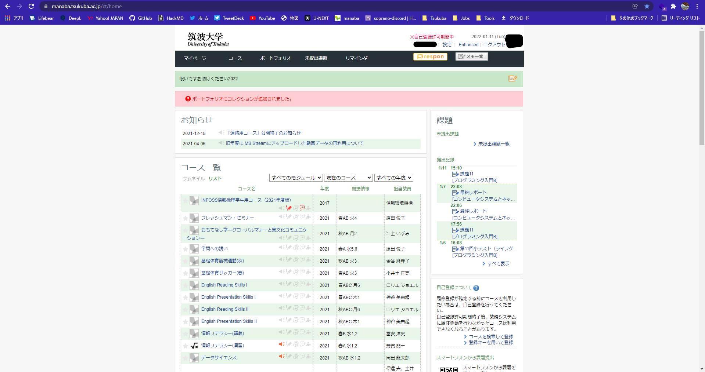

---

<h3 align="center" > modern-manaba (beta) </h3>

:star:

 

<b> ManabaのUIを変えるChrome拡張 </b>

--- 

- [x] ヘッダの変更
- [x] トップページの変更
- [x] コース一覧ページの変更
- [ ] ポートフォリオページの変更
- [ ] 未提出課題ページの変更
- [ ] コースページの変更
- [ ] リマインダページの変更

## ベータ版の使い方
1. リポジトリを fork & cloneする。
2. Chromeで拡張機能の管理のページを開き、右上のデベロッパーモードを有効化する。
3. 左上「パッケージ化されていない拡張機能を読み込む」から、クローンしたリポジトリのフォルダ内、srcを指定する。

＊GitHubを利用していない場合などには、GitHub上からCode --> Download ZIP を押すことで入手することもできるが、今後アップデートのたびに毎回ダウンロードして差し替えないといけないので非推奨。